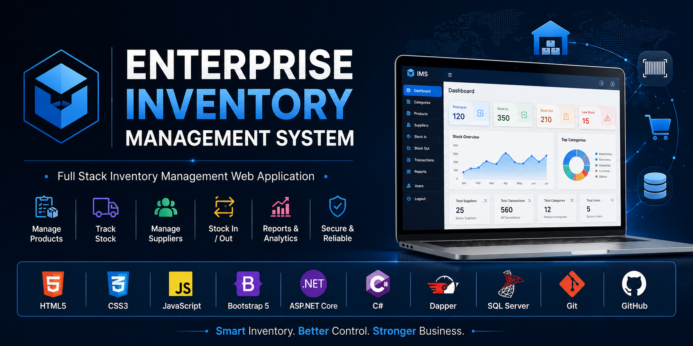

  

<h1 align="center">Enterprise Inventory Management System</h1>

A Full-Stack Inventory Management Web Application built using HTML, CSS, Bootstrap, JavaScript, ASP.NET Core Web API, Dapper, and Microsoft SQL Server.

---

# 📖 About the Project

Enterprise Inventory Management System is a full-stack web application developed to efficiently manage inventory operations for businesses. The system provides secure authentication, product management, category management, supplier management, stock tracking, transaction history, reports, and dashboard analytics using a modern ASP.NET Core Web API backend and Microsoft SQL Server database.

---